# 💫 About Me:
It's cavoixanh1806 !!!  
🎓 Cybersecurity Student @ Military Technical Academy (MTA)

## 🌐 Socials:
        

# 💻 Tech Stack:

### 🛡️ Cybersecurity & Networks
             

### 🔓 Reverse Engineering & Game Hacking
        

### 🧠 AI, Data Science & Data Mining
       

### 🔌 Low-Level, OS & ROM Development
        

### 🚀 Programming Languages
                  

### 🌐 Web & App Development
                    

### 🛠️ Systems, DevOps & Cloud Hosting
* **Virtualization & Systems:**               
* **Cloud Hosting & Providers:**             

### 🎨 Design & Multimedia
                       

### 🎮 Others

# 📊 GitHub Stats:
 
 

## 🏆 GitHub Trophies

### ✍️ Random Dev Quote

### 🔝 Top Contributed Repo

---

<!-- Proudly created with GPRM ( https://gprm.itsvg.in ) -->
